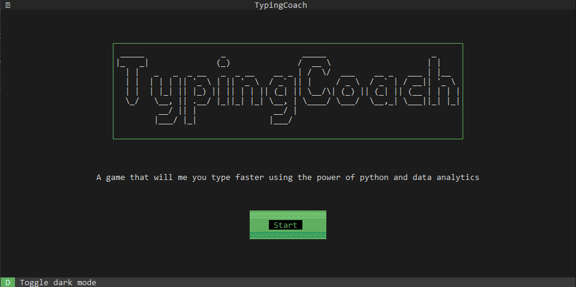

Heads-up: this project is still in early developement stages.
# TyperCoach

TyperCoach is a Python-based typing speed improvement tool designed to help users enhance their typing skills efficiently. Built using Python's Textual library, the program provides a user-friendly terminal interface, offering an intuitive experience for users to practice and enhance their typing speed.

## Requirements

- Python 3.7+
- Textual library (install via pip: `pip install textual`)

## Usage

1. Clone this repository to your local machine.
2. Navigate to the project directory.
3. Run `python app.py` to start the program.

## What's Next?

Here are several enhancements planned for future versions:

- **Data Analytics**: Addition of data analytics at the end screen to help users identify which keys they lack the most, providing targeted areas for improvement and personalized traning.
- **Web Version**: Development of a web-based version of the application to increase accessibility and reach a wider audience.

## Contribution

Contributions are welcome! If you have any suggestions, bug reports, or feature requests, please open an issue or submit a pull request.

## License

This project is licensed under the [MIT License](LICENSE).